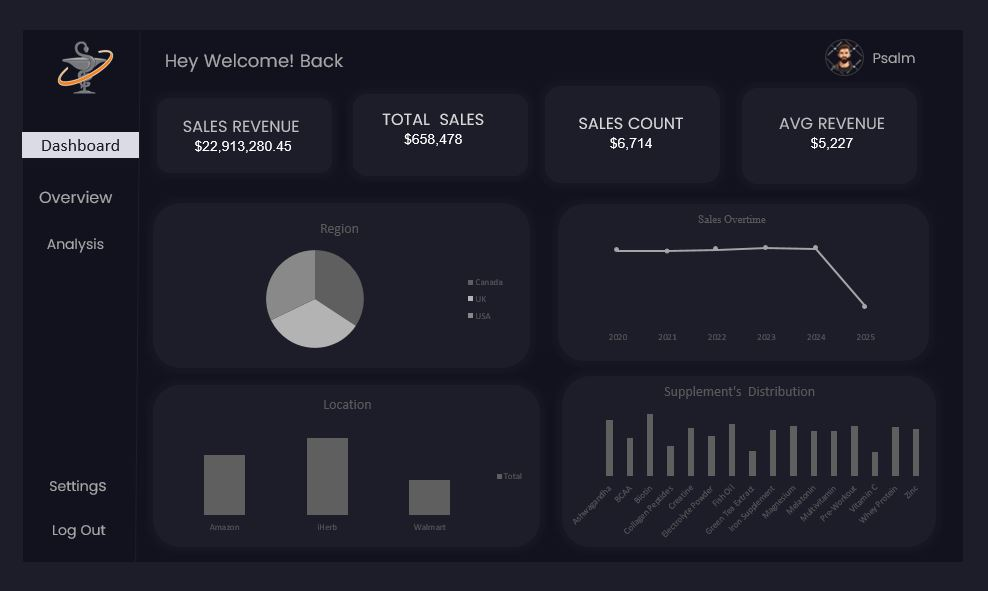

# Supplement's-Sales-Analysis

---

## Introduction
This is a Microsoft Excel Analysis of Sales called **Supplement's Sales**. This project is to analyse and derive insights to answer crucial questions that will boost sales and make data-driven decisions   

**_Disclaimer_** : **_All datasets and reports do not represent any company, institution, or country, but are used to demonstrate Analysis using Microsoft Excel_**

## Skills Acquired 
1. Data Cleaning and Preparation
2. Data Exploration
3. Data Visualization
4. Problem Solving and Analytical Thinking

## The Approach

### The Dataset 

Things done on the dataset: 
- handling missing or inconsistent data.
- Removing duplicates and outliers.
- Formatting data types
  
_The Dataset is ready for visualization_

## Problem Statement

- Which Location Generated the Highest Sales?
- Which Platform Recorded the Highest Sales?
- Which Product Recorded the Highest Sales Across Platforms and Locations?
- Evaluation of Sales across the Years (2020–2025)

_Approach to Problem Statement_: Using a pivot table in Microsoft Excel

## The Analysis

1. Which Location Generated the Highest Sales?
Using a Pivot Table, the location that generated the highest sales in supplements is Canada, with a total revenue of ₦7,848,579 and an average unit sold of 150.
This is followed by the UK and the USA, which recorded ₦7,703,960 and ₦7,360,740 respectively, with average units, sold of 149.99 and 150.63.
✅ Insight: Canada recorded the highest revenue among all locations, indicating strong market demand and sales performance in that region.
________________________________________
2. Which Platform Recorded the Highest Sales?
Based on the Pivot Table analysis, the platform with the highest total sales is iHerb, generating ₦7,855,261 in total revenue.
This is followed by Amazon and Walmart, with revenues of ₦7,669,452 and ₦7,388,568 respectively.
✅ Insight: Iherb leads the market among online platforms, suggesting it is a key sales channel for supplements.
________________________________________
3. Which Product Recorded the Highest Sales Across Platforms and Locations?
The product with the highest total sales across all platforms and locations is Biotin Supplements, with total revenue of ₦1,486,798.62.
✅ Insight: Biotin Supplements are top-performing products, likely due to strong consumer demand for hair, skin, and nail health products.
________________________________________
4. Evaluation of Sales across the Years (2020–2025)
Trend Summary: 
From 2020 to 2024, total revenue remained fairly stable, showing a steady and gradual increase each year, which indicates consistent sales performance and market growth.
However, in 2025, there is a sharp decline in total revenue, marking a significant drop compared to previous years.
✅ Insight: This sudden decline may be due to factors such as market saturation, reduced consumer demand, supply chain disruptions, or increased competition. Further investigation is needed to identify the root cause.

## The Dashboard

## Conclusion

The sales analysis from 2020 to 2025 reveals consistent growth in supplement sales across regions and platforms until a notable decline occurred in 2025. Canada emerged as the leading sales location, while iHerb proved to be the most profitable platform. Biotin Supplements stood out as the highest-selling product, highlighting strong consumer interest in wellness and beauty-related supplements.

Although the market showed stability over the years, the sudden drop in 2025 suggests emerging challenges that require prompt investigation. By focusing on high-performing regions, strengthening partnerships, promoting top-selling products, and analyzing the cause of the 2025 decline, the company can improve future sales performance and regain growth momentum.

## Recommendation

Based on the findings from the supplement sales analysis (2020–2025), the following recommendations are suggested to improve sales performance and strategic decision-making:

- Focus More Marketing and Distribution Efforts in Canada
Since Canada generated the highest total revenue, expanding product availability, targeted promotions, and customer engagement strategies in this region can further increase sales.

- Strengthen Partnership with iHerb
IHerb recorded the highest sales among platforms. Increasing product visibility, running exclusive deals, and negotiating better placement on the platform can maximize returns.

- Increase Stock and Promotion for Biotin Supplements
Biotin was the top-selling product. Maintaining adequate stock levels, bundling with complementary supplements, and highlighting product benefits can help boost revenue even more.

- Investigate the Revenue Decline in 2025
The sharp drop in revenue in 2025 signals a problem. A deeper analysis should be carried out to determine possible causes such as:

- Reduced consumer spending

- Stronger competition

- Supply chain issues

- Pricing or discount strategy changes
- Understanding the root cause will prevent further declines.

- Enhance Customer Retention Strategies
Using customer feedback, loyalty programs, and personalized marketing may help stabilize sales, especially in low-performing years.

- Optimize Pricing and Discount Strategies
Monitor how discount levels affect sales volume and revenue. Adjust pricing to maximize profit without losing customers.

